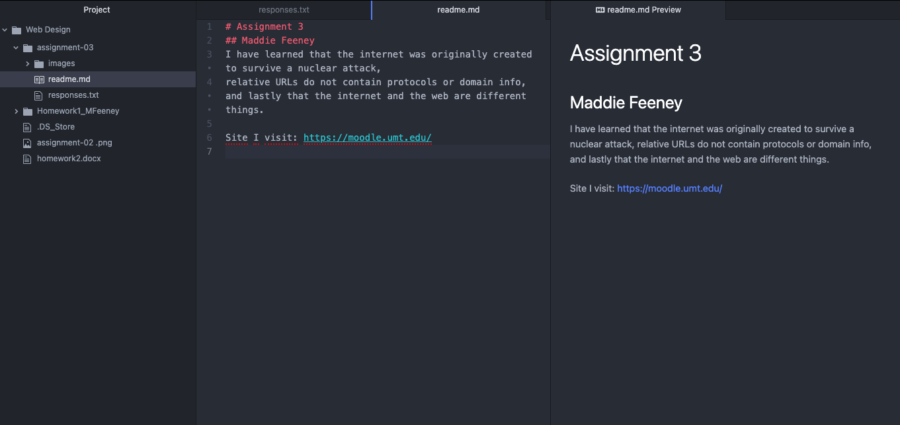

# Assignment 3
## Maddie Feeney
I have learned that the internet was originally created to survive a nuclear attack,
relative URLs do not contain protocols or domain info, and lastly that the internet and the web are different things.

[Moodle](https://moodle.umt.edu/)

[My Responses](./responses.txt)

