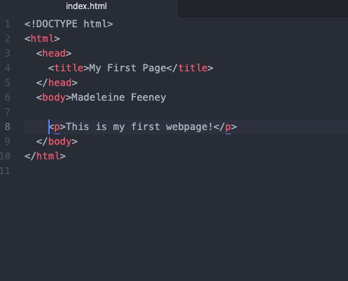

# Assignment 4
## Madeleine Feeney
13. Browsers function by translating the various kinds of web languages like HTML, CSS, and JavaScript into text, images and other content  to be viewed on a device. I use chrome most frequently.

14. Markup language controls the composition of a page. HTML is the most commonly used web language and is used to render content and page structure. It acts as the bones of a page's content.

