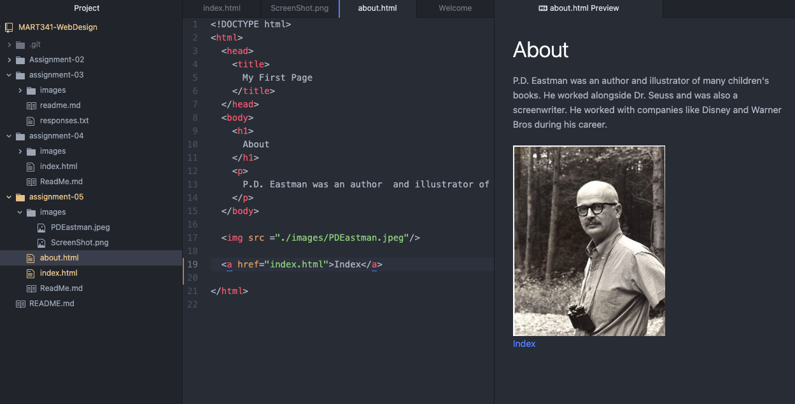

# Assignment 5
## Madeleine Feeney
1. I went to amazon and it reminded me of the way that craigslist looks. It was just a bunch of lists of various categories. Now Amazon is a lot easier to use and the site is more so dominated by images of products rather than listing them off
2. I liked creating paragraphs and adding a bit more structure like a heading and embedding images. I had a bit of a hard time figuring out linking my about page and index.

